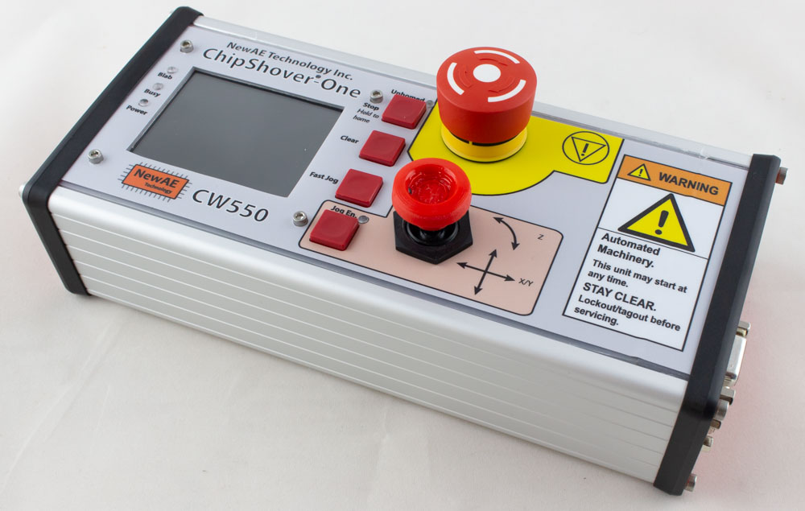

# ChipShover®

ChipShover is an XYZ table &amp; driver, with handy Python interface. It's designed for close analysis of ICs using tools like Electromagnetic Fault Injection (EMFI), EM Probes for side-channel, and more. In both specifications and cost it falls somewhere between between 3D printers & microscope stages.

ChipShover consists of the following main parts:

* Physical XYZ Stage (based on stepper motors).
* Interposers to mount tools onto the stage.
* Controller for XYZ stage (based on open-source Marlin firmware).
* Python interface on computer.

## Physical XYZ Stage

The physical XYZ stage is designed for two major variants, however you can easily customize it based on tables and parts you have on-hand. These variants are presented to simplify your general choice of options. They are currently called the *medium-resolution* stage (around <1 um resolution, in practice around 250 nm), and a low-resolution stage (around ~XX um resolution).

### Medium-Resolution Stage (< 1 um)

The medium-resolution stage uses a combination of standard aluminum extrusion pieces, some custom CNC made pieces, and a 'fairly good' XYZ stage sourced by NewAE. You can find alternate versions for most of the pieces and interface them with our system.

If you wish to have minimum hassle, this is available in an easy-to-assemble kit. This kit comes with an XYZ stage that has been checked with a laser interferometer to validate the overall linearity, backlash, etc.

### Low-Resolution Stage

The low-resolution stage uses a CNC frame fairly widely available on AliExpress and similar. With this version you must buy the stage yourself - the size and lowish cost of the stage makes it not worth carrying for NewAE! The cost is significantly lower, with more hassle in the purchasing process and somewhat lower resolution and specifications on the resulting table.

## Interposers

The XYZ stage is designed to fit a variety of tools using a 50x50mm bolt pattern. Currently, this has the following interposers:

* ChipSHOUTER® holder.
* Pen-Style EM probe holder.

These interposers can be 3D printed from files in the repo, or you can buy machined versions.

## Controllers

The controller is based on 3D printer controllers which have extensive community resources behind their hardware and firmware. The ChipShover controller is specifically based on the Arduino DUE, which uses a Microchip SAM3X (we use the similar SAM3U in many of our products already which was our reasoning).

The firmware is open-source and is a [build of Marlin2 with a custom board type](https://github.com/newaetech/ChipSHOVER-Marlin). The board is designed to be the ChipShover-One ($1300 for enclosed & tested unit, lower-cost version planned around ~$350). Other boards such as the [Archim2](https://ultimachine.com/products/archim2) are possible with some limitations (approx $180 for board + some cables needed).

### ChipShover-One

*Beta unit shown with 3D printed parts*

The ChipShover-One is our own stepper controller. While there are hundreds of already existing controllers out there, we figured why not make it interesting with our own take? Several feature relevant to the ChipShover usage that are not widely available in existing 3D printer driver boards were specifically added:

* 3 endstop inputs per axis (2 endstops, 1 higher-resolution home).
* Swappable driver boards to work with different tables.
* Easy user API over USB (Ethernet optional).
* Higher drive current (~2.4A).
* Extension connectors for each axis (currently RS485 + I2C + single GPIO used for "stop" input).
* Physical E-Stop button that disconnects power to motors.
* User interface including colour LCD.

As there are *hundreds* of low-cost open-source stepper controllers out there, the ChipShover-One hardware is not *currently* released as full OSHW. Schematics and other information *is* available for your use already. As we finish releasing this it's likely ChipShover-One will become more open.

### Archim2

The Archim2 board is an open-source hardware controller board. It is [sold by UltiMachine](https://ultimachine.com/products/archim2) and can be used to make a board that is compatible with the ChipShover Python API.

The primary limitation of the Archim2 is a lower default resolution (~1um) due to the lower drive current, and only being able to use the mechanical endstops for homing. In practice this solution with an Archim2 still has many advantages compared to an off the shelf 3D printer. See more details in the [Archim2 setup folder](controller-hardware/diy-with-archim2).

## Python Interface

A Python interface simplifies use from existing Jupyter notebooks and similar.

Here is an example usage to sweep an IC surface from (10.0, 10.0) to (12.5, 12.5) in 0.05mm steps. Also plunge the Z-axis down to touch a probe to the surface at each location (useful when probe cannot be dragged across surface safely).

	from chipshover import ChipShover

	shv = ChipShover('com3')

	shv.home()

	for x,y in shv.sweep_x_y(10, 12.5, 10, 12.5, step=0.05, z_plunge=1.5):
	    print("At %f, %f"%(x,y))

#### Disclaimers and all that

ChipSHOUTER and ChipShover are registered trademarks of NewAE Technology Inc.