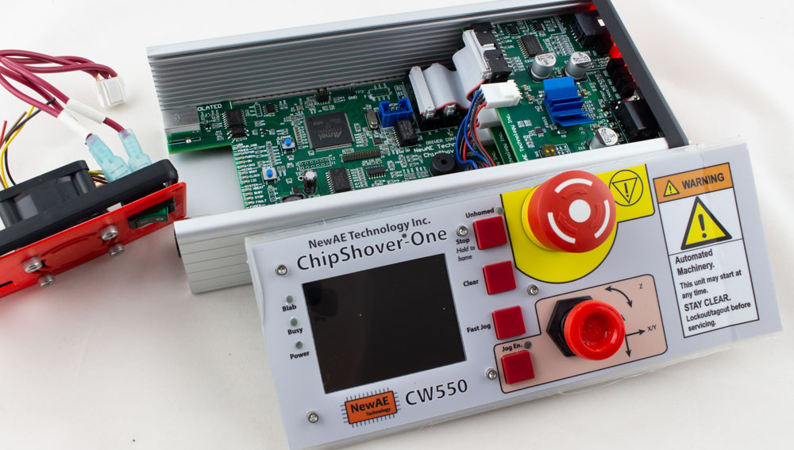

# Stepper Controllers

## ChipShover-One

ChipShover-One is NewAE Technology Inc's premium control box. When people come into your lab, they will know you mean serious business. We've done things like using a joystick which cost more than the entire BOM of other lower-cost solutions, but has the right "stick feel" compared to cheaper solutions.

But it's not just nice stick-feel that make this such a nice tool - with ChipShover-One you get capabilities like:

* High-power stepper drivers per channel - allows microstepping without losing steps.
* Physical jog stick for X/Y/Z.
* Physical pause/stop button to abort moves *without* killing motor power (device maintains position).
* E-Stop button to abort moves & *kill motor power* (device is no longer accurate).
* Colour TFT Display for feedback on position, motor driver status, etc.
* Active cooling for stepper drivers.
* Python 3 API Interface for usage in Jupyter notebooks.
* Compact desktop size.
* Future upgrades include Ethernet interface for remote control (hardware present but not used).

Beneath the hood, we're worked hard to give you a lot of flexibility that you won't find in proprietary solutions:

* Microchip SAM3X8E (Arduino Due chip) based controller running Marlin2 firmware (open-source)
* Swappable driver boards allow replacement when damaged, or for changing to other motor types (5-phase stepper, DC servo, etc).
* Default driver boards feature:
	* TMC2660 Based 2-phase Stepper Drivers
	* 3 end-stops per channel (min / max / origin) with noise filtering.
	* LED status indicates physical state of each end-stop for help with initial setup.
	* RS485 + I2C + GPIO Extension connectors *per channel*.

The extension connectors allows implementation of additional features, such as adding a "crash detection" probe. This allows the controller to automatically abort a movement if it detects the chip surface contact (**NB: this feature requires you to implement it currently**). They could also allow usage of an external encoder or other feedback.

### ChipShover-One Controller Kit

**$1300 (Estimate)**

* ChipShover-One in Aluminum Enclosure
	* 3x 2-Phase Stepper driver board (CW562) installed for X/Y/Z.
	* 1x 2-Phase Stepper driver board (CW562) spare (for quick replacement if you blow a channel somehow).
* 120W power supply (24V / 5A) with US + EU plugs included
* 3x 1m stepper motor cables
* 3x stepper motor breakout boards (for connecting tables besides the NewAE one)
* 1x stepper motor diagnostic board (allows scoping signals)
* 3x 0.1m extension cables
* 3x 1m extension cables
* 3x extension cable breakout connectors
* 2x spare fuses
* 1x USB 2.0 cable
* 1 year warranty

## ChipShover-Three-Quarters

**$350 (Estimate)**

ChipShover-Three-Quarters is a variant of ChipShover-One for people who want a lower-cost option but most of the core functionality. In order to reduce the cost, this solution does not come with the aluminum enclosure, and instead is designed to have all the boards mounted on the backside of your device (or just on a table). It requires some assembly (making cables, simple soldering, etc) and some parts (switches).

The main *missing* things:

* No enclosure.
* No E-Stop button provided.
* No Joystick (jog buttons instead of joystick - soldering required).
* No cooling fan.
* No 'extension' parts on controller boards (only needed for RS485/I2C extension - not used currently anyway).
* No power supply included (needs 24V @ 2-5A depending on your table).
* No warranty!

We felt that having a medium-cost option was important to make it easier to any researcher to have access to the same controller, as it makes it easier for us to all share results and demos. With ChipShover-Three-Quarters, you still get:

* High-power stepper drivers per channel - allows microstepping without losing steps.
* Physical pause/stop button to abort moves *without* killing motor power (device maintains position).
* Colour TFT Display for feedback on position, motor driver status, etc.
* Python 3 API Interface for usage in Jupyter notebooks.
* LED status indicators of driver end-stop state.

The ChipShover-Three-Quarters *is* more than many cheap 3D printer motherboards on account of our lower volume (we test all boards extensively) & the specific features added to be helpful for our ChipShoving use-case.

We have published details of using the ChipShover API with generic motherboards as well so you can also access some ChipShover features from any 3D printer.

The ChipShover-Three-Quarters mainboard is identical to the ChipShover-One, so the same firmware features can be used on either board.