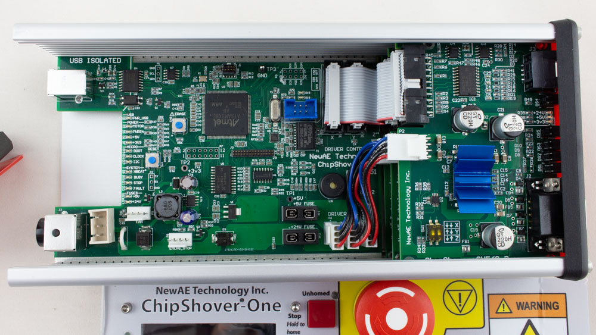
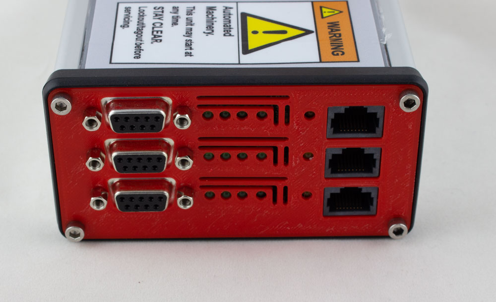
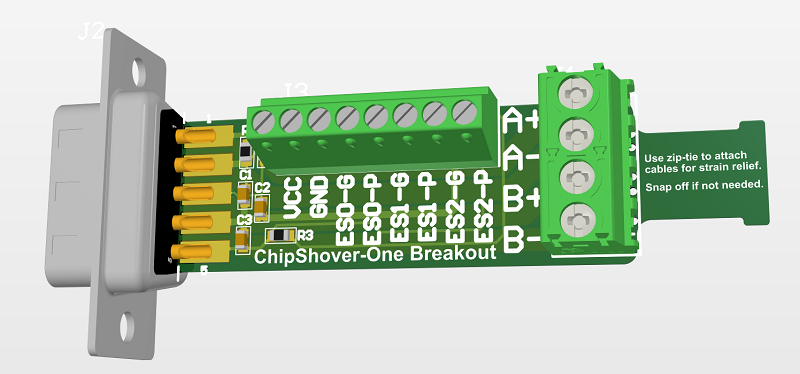

# ChipShover-One

## ChipShover-One Specs

## ChipShover-One Front Panel Interface

## ChipShover-One 2-Phase Stepper Drivers

The default (and only) interface board for the ChipShover-One is a 2-phase stepper driver board. Each of the X/Y/Z axis has the same board, visible at one end:

*Beta unit shown with 3D printed parts*

From left to right, the outputs are:

* DB9 = Axis connection, with stepper + Limit Switches.
* Status LEDs.
* Extension Connector (RJ45 - not ethernet).

### Connecting ChipShover-One to Generic Tables

ChipShover-One is designed to work "out of the box" with NewAE's XYZ table kit. But it also works with almost any other table - in fact, the entire point of ChipShover-One is to make it easy to grab a CNC frame and get a reasonably accurate positioning solution with much less fuss than you have when re-purposing a standard 3D driver controller.

For connecting to other tables, you simply need to wire them to the DB9 connector. For your convenience, a breakout board is included with the main ChipShover-One kit (you can find the schematic + gerbers in this repo as well if you are using ChipShover-Three-Quarters).

#### Stepper Connections

#### Endstop Connections