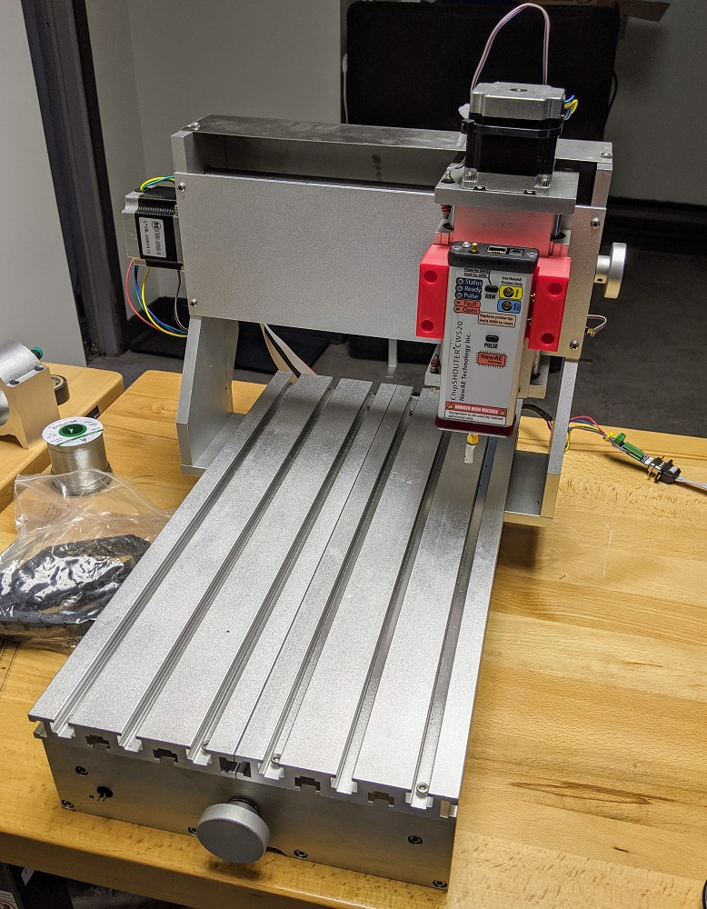
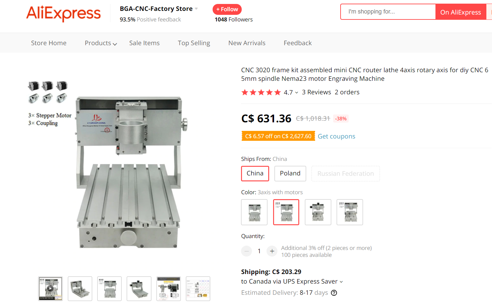
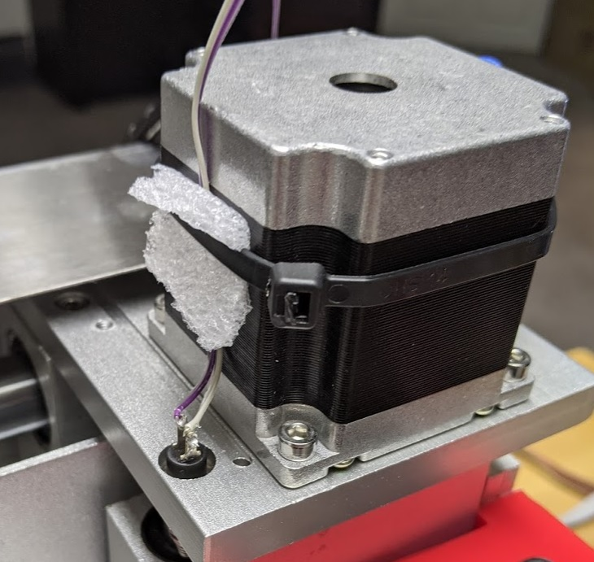
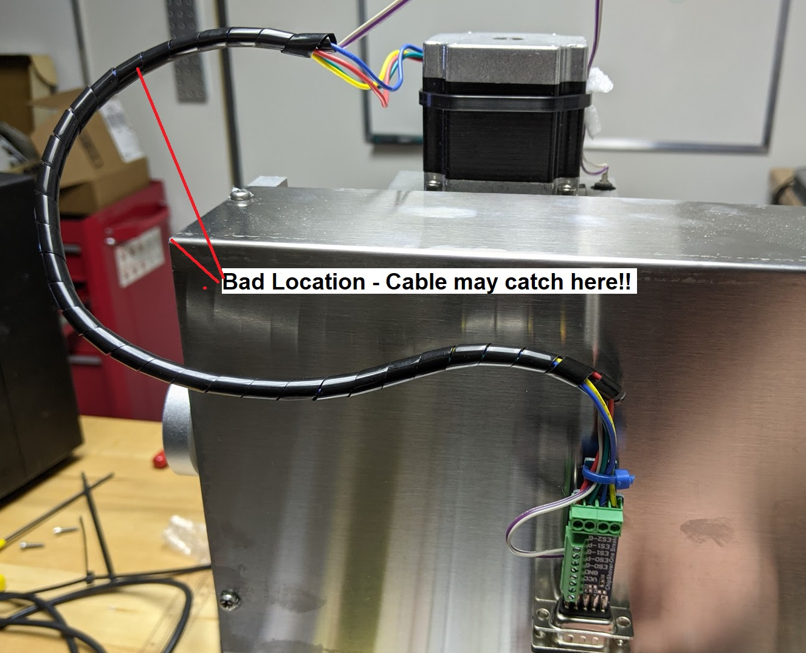
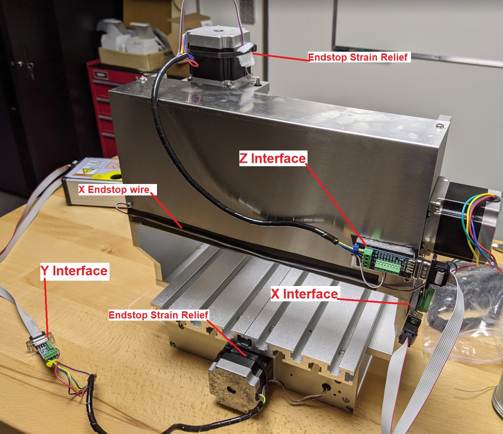
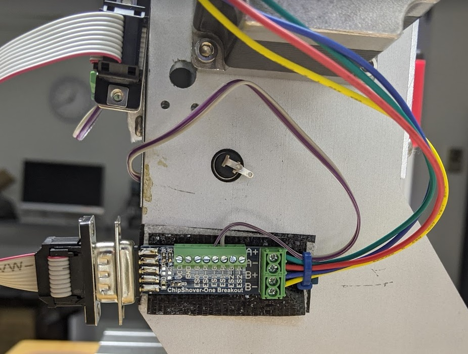
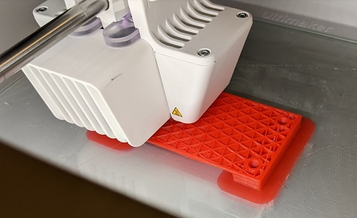
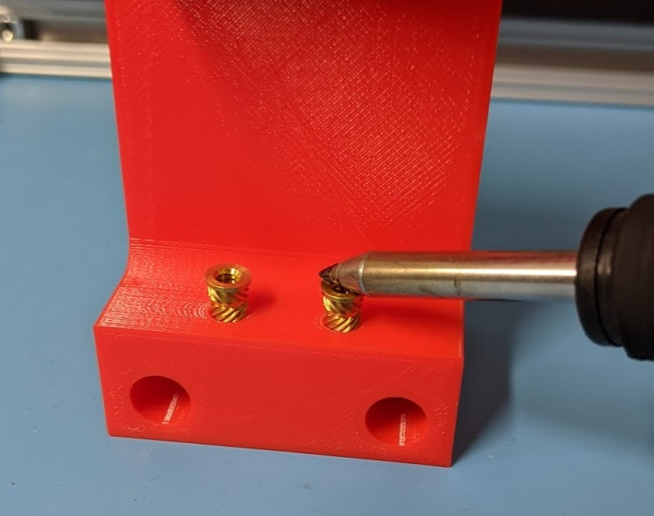

# Low Resolution / Cheapish CNC Frame



These instructions show you how to translate a kinda cheap CNC frame into a high quality EMFI or SCA XYZ scanning solution using the ChipShover-One.

Once you are done you'll have a solution with around 1um resolution (although considerably more backlash & overall error).

## Selecting a CNC Frame

When selecting a CNC frame, we were looking for the following features:

* Bed remains stationary
	* Most 3D printers & CNC move the bed as the Y or X axis - you are certain to have cables attached to your target device, and the target moving increases the chance you'll pull on the target by accident, shifting it's position.
* "Head" holder is removable without affecting Z axis.
* Ships mostly assembled.
	* Low effort setup.
* Includes limit switches (ideally min & max).
	* Some low-cost machines use motor stalls instead of real end stops. ChipShover-One doesn't support this currently.

The Y axis moving is often OK in practice if you are careful with the setup. But as we are trying to build a general setup for your lab environment, we didn't want to worry about this.

The removable holder for the motor/laser is handy as we'll need to 3D print a ChipSHOUTER holder instead (or whatever other probe you want to hold).

## "CNC 3020 frame kit" by L.Y. GROUP CHINA 

The suggested low-res frame is called the "CNC 3020 frame kit". Be sure to get the kit with stepper motors if you want to follow along. The frame I received *didn't* have the L.Y. group silkscreen on the frame - it's not 100% clear if this is a clone or legitimate frame. The specific store I purchased from looked like this:




### Frame Assembly

The frame ships assembled, you just have to mount motors on it. To tighten the couplings onto the stepper motors you'll have to remove a few of the aluminum panels.

The frame has a *lot* of grease on it I found - take a rag and clean up some of this.

### ChipShover to Frame Interface

Interfacing the ChipShover to the frame requires you to:

* Connect the stepper drivers.
* Connect the endstops.

This is easily done with the stepper breakout boards, or you can terminate a DB9 cable into the stepper motors & endstops directly.

**WARNING**: The wire shipped with the table for the endstops was amazingly terrible. In addition, the endstop buttons are very cheap and the contacts will very quickly melt into the plastic of the endstop when soldering. You must be **very** careful when soldering to it. I would recommend getting some stranded (not solid core as it needs to flex - don't just steal some wire from a CAT5 cable) & some replacement push buttons.

Where the endstop wire will flex, I fixed the wire to the frame or stepper motor, as shown here:



When mounting the boards - make sure you don't mount them somewhere that might cause the cables to catch. For example, here is a poor location as the cable may catch when the X axis moves from one side to the other:



The overall locations I used for this example is shown below:



Some important setup notes:

* Cables have been cut to length - you don't want a lot of excess cable as that is liable to be caught by something.
* The X endstop wire is taped onto the back cover, and routes to the X interface. ChipShover assumes X=0 is to the right, so we've used that right endstop as the `MIN`.
* The cable covering was provided with the 3020 frame - it's just been cut to each length as needed.
* Interface boards are attached with tape - be very careful they can't fall off, suggest to use Zip-Ties. If they fall off they may **short out and blow up the ChipShover**. 
* Breakout ('interface') boards use a zip-tie to help with strain relief (the breakout board has an area designed for this).

**Z Axis Wiring**:

| Wire | Connect To | Note |
|------|----------- |------|
| Red  | A+         | Stepper |
| Green| A-         | Stepper     |
| Blue | B+         | Stepper |
| Yellow | B-       | Stepper |
| Switch | ES1-G    | TOP endstop (max) |
| Switch | ES1-P    | TOP endstop (max) |

Be sure to secure the endstop cable so it doesn't pull the wires from the switch.

**X Axis Wiring**:

We reverse the X axis stepper so it goes "backwards" - you can do this in firmware too.

| Wire | Connect To | Note |
|------|----------- |------|
| Green  | A+         | Stepper - reversed! |
| Red | A-         | Stepper - reversed!     |
| Blue | B+         | Stepper |
| Yellow | B-       | Stepper |
| Switch | ES1-G    | RIGHT endstop (min) |
| Switch | ES1-P    | RIGHT endstop (min) |

The right endstop (right when looking from the FRONT) is used, so we run the wire across as shown in the previous photo.



(The endstop in the photo was rather smushed from shipping)

**Y Axis Wiring**:

| Wire | Connect To | Note |
|------|----------- |------|
| Red  | A+         | Stepper |
| Green | A-         | Stepper|
| Blue | B+         | Stepper |
| Yellow | B-       | Stepper |
| Switch | ES1-G    | REAR endstop (min) |
| Switch | ES1-P    | REAR endstop (min) |

Be sure to secure the endstop cable so it doesn't pull the wires from the switch.

### Checking Interface

Todo - using LEDs.

### ChipShover Settings

* X/Y axis is 1605 ball screw = 1280 steps/mm (@32 microsteps)
* Z axis is 1204 ball screw = 1600 steps/mm (@32 microsteps)

You can configure this with:

```
shvr.set_stepsmm(1280, 1280, 1600)
```

Or you can pass this as an option to the initial object:

```
shvr = ChipShover(comport="com3", stepsmm=(1280, 1280, 1600))
```

You can alternatively rebuild the firmware with your specific table defaults (eventually we will support storing this to EEPROM, not possible yet).

### ChipSHOUTER mounting bracket

You can 3D print a mounting bracket that replaces the spindle holder.

* Remove the M4 bolts holding the motor/spindle holder.
* 3D print the model in this repository - there are two versions of this holder.:
	* "Hardware Needed" version uses heatset screw inserts.
	* "Cheap Version" does not require any hardware.
* Bolt the holder back into position using M4-16 bolts. You may need to loosen the Philips screws holding the aluminum Z-ballscrew cover plate, as it's a very tight fit over the cover plate, and there is some play in the cover plate position once the screws are loose. Tighten the Philips screws back after. 
* Use a 6-32 bolt to secure the ChipSHOUTER.

When 3D printing, I was able to get away without adding support structure:



If using the hardware needed version, sink a 6-32 = 0.281" length flanged insert, such as [McMaster-Carr 97171A140](https://www.mcmaster.com/97171A140/) using a soldering iron.



You'll then need a 6-32-1/2" bolt to secure the ChipSHOUTER. You way wish to get a softer tip option, such as [McMaster-Carr 90299A145](https://www.mcmaster.com/90299A145/). This will leave a smaller mark on the ChipSHOUTER enclosure.

## Accessories

For mounting your board to your table, you can use the ChipShover Mounting Kit. This includes T-Slots that will fit this table, and allow you to use the interface feet.

Alternatively, you can 3D print mounting brackets that may fit your specific board & table setup.