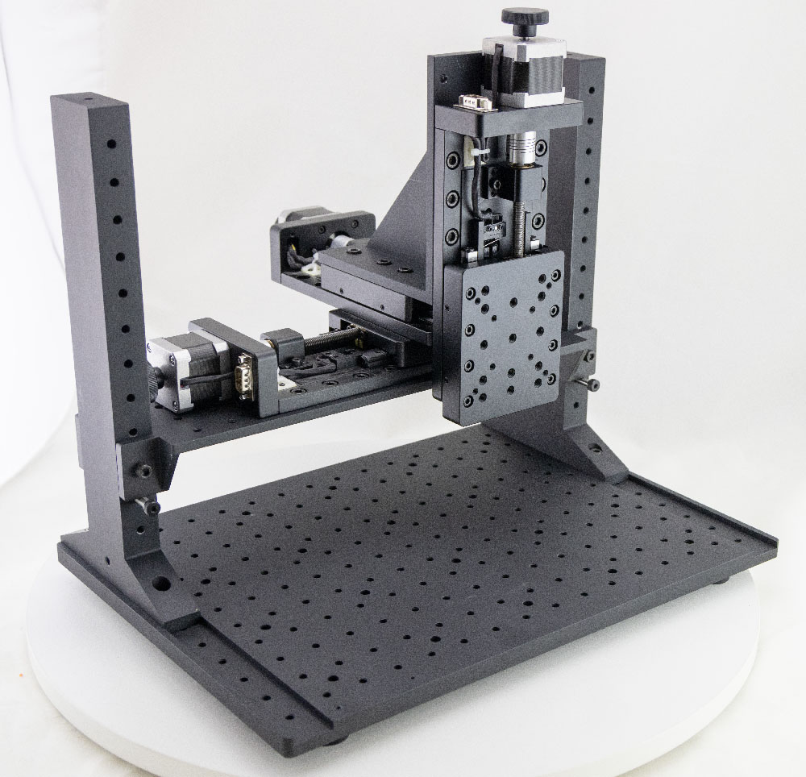

# ChipShover Stage

## Rev 2
ChipShover Rev 2 is the production release of ChipShover, shipped from 2024 and onward. This page provides documentation for this production version. There is currently no printed documentation. 

See [Rev1Assembly.md](Rev1Assembly.md "Rev 1 Assembly Document") for assembly instructions.

See [Rev1Instructions.md](Rev1Instructions.md "Rev 1 Instructions Document") for usage instructions.

NOTE: The X stage is mounted backwards in this photo - the assembly instructions above have it the correct way around.

## Rev 1
ChipShover Rev 1 is the initial beta release of the ChipShover. This page provides documentation for these early versions.

See [old_revisions/Rev1Assembly.md](old_revisions/Rev1Assembly.md "Rev 1 Assembly Document") for assembly instructions.

See [old_revisions/Rev1Instructions.md](old_revisions/Rev1Instructions.md "Rev 1 Instructions Document") for usage instructions.

## Rev 0

The first alpha release was called rev0:

This page provides documentation for these early versions:

See [old_revisions/Rev0Assembly.md](old_revisions/Rev0Assembly.md "Rev 0 Assembly Document") for assembly instructions.

See [old_revisions/Rev0Instructions.md](old_revisions/Rev0Instructions.md "Rev 0 Instructions Document") for usage instructions.