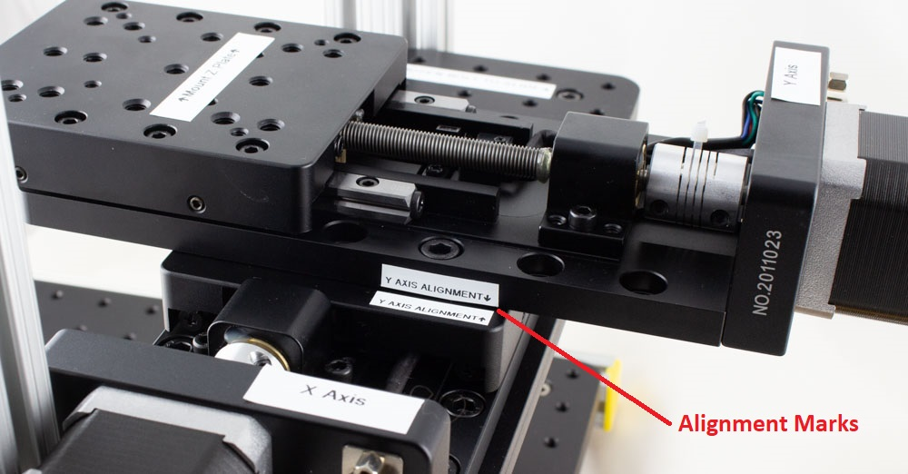
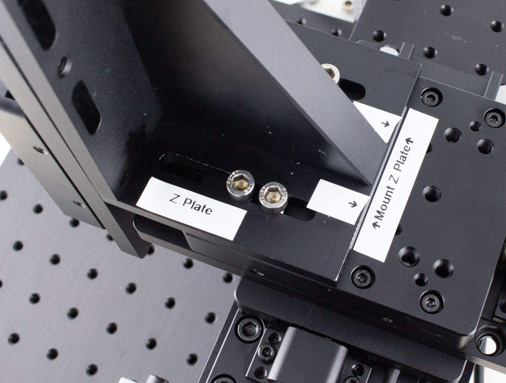
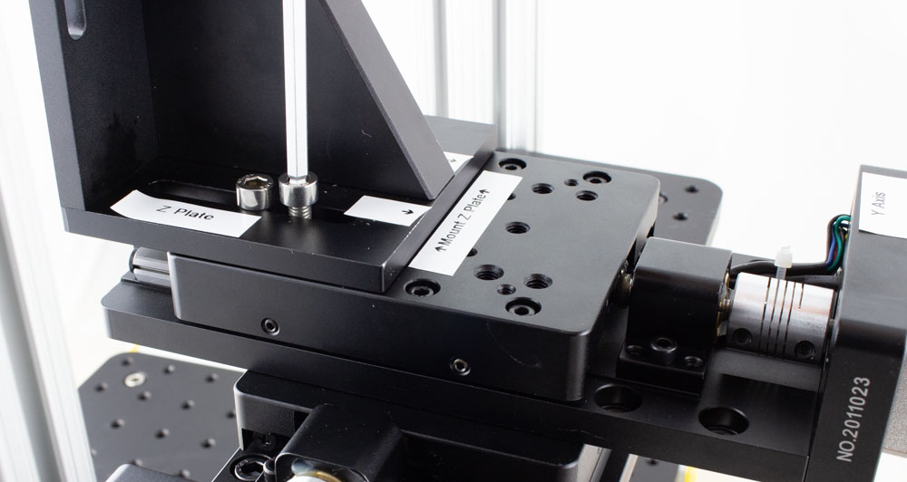
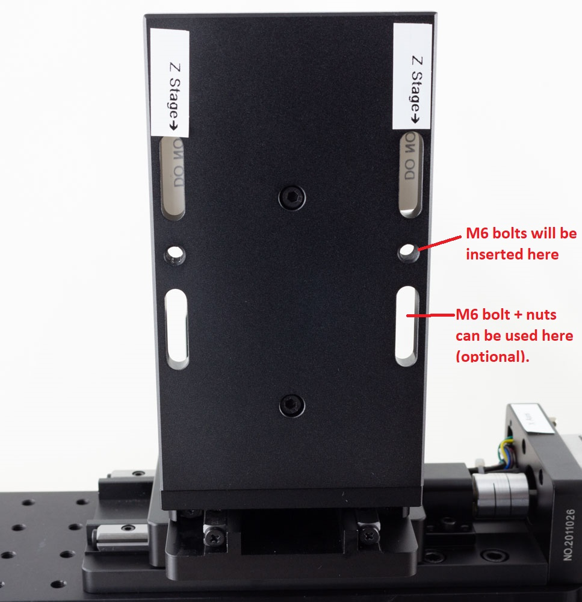
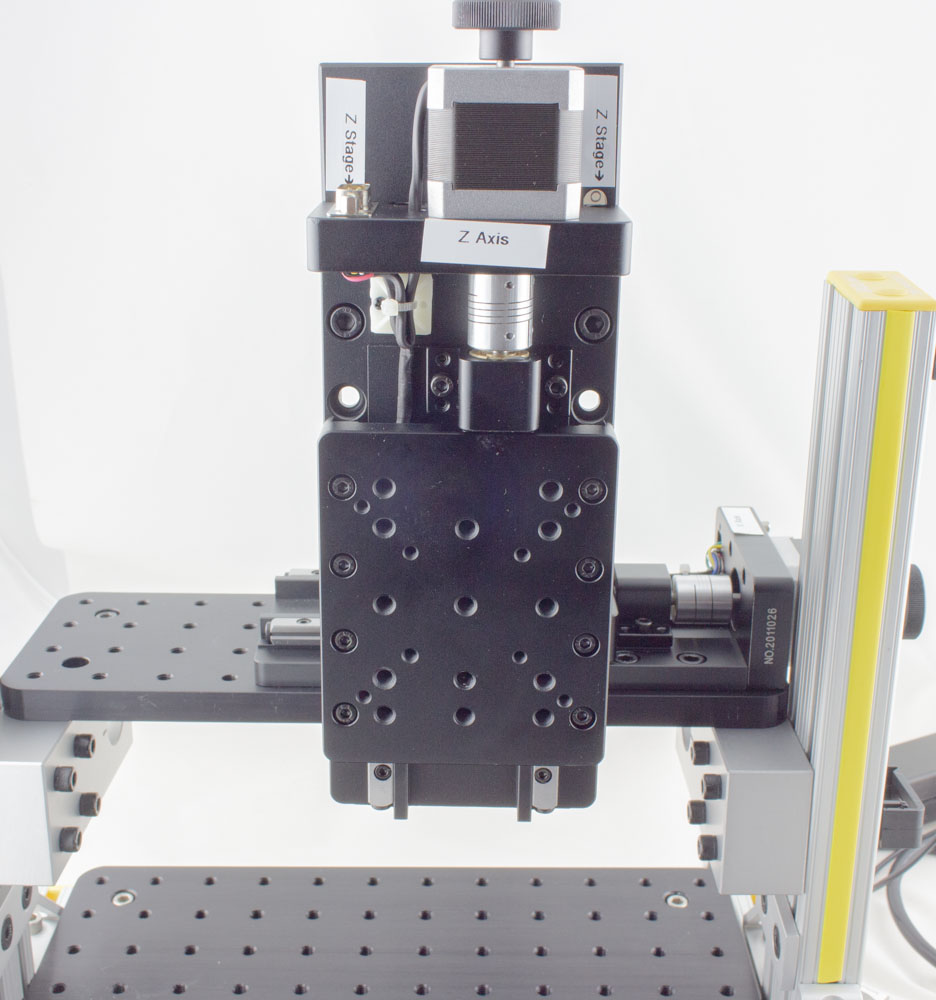
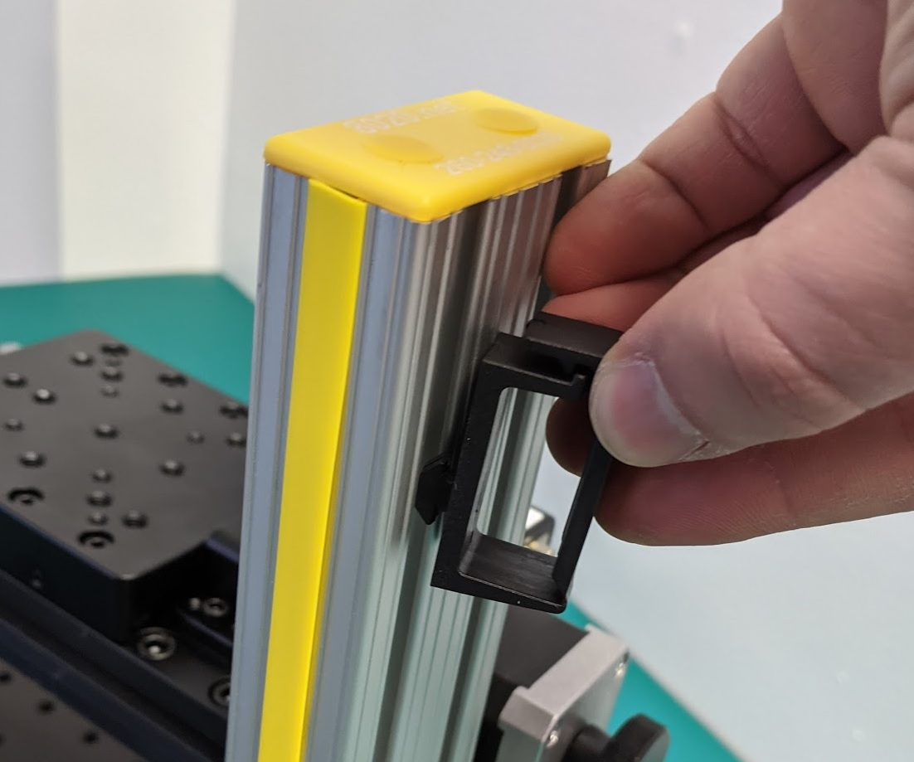
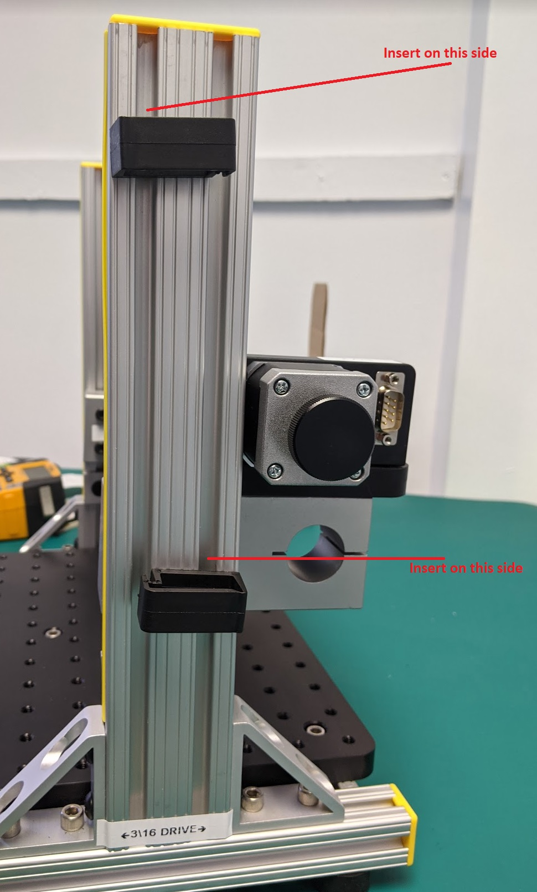
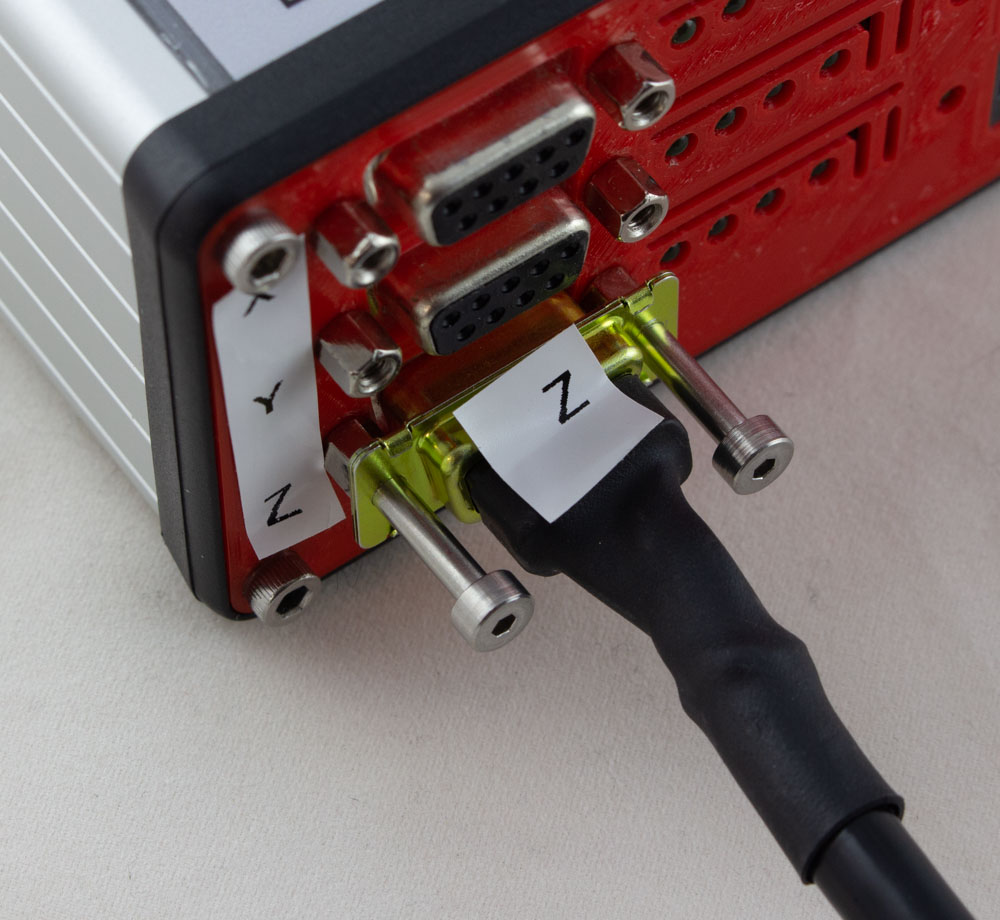
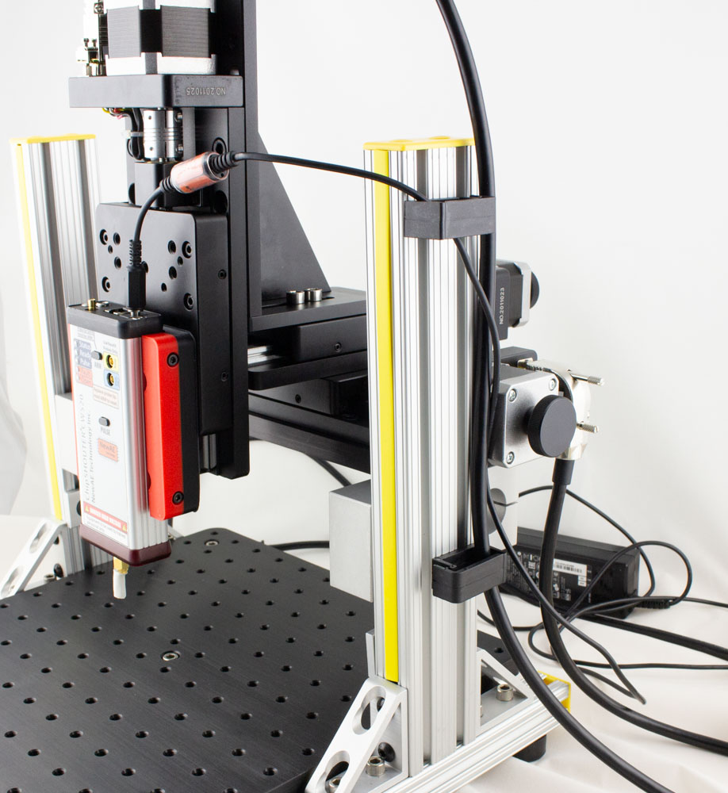
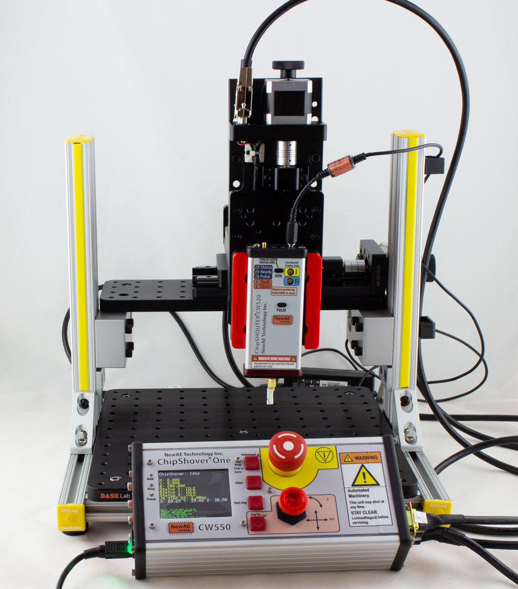

# Medium Res Stage - Rev 0 Assembly

## Parts

Your shipment should contain the following boxes:

**Box 1: Frame with X Axis Stage**

 * Frame with X Axis already mounted
 * Extra-long 3/16" ball-end T-Handle driver
 * Extra-long 5/8" ball-end T-Handle driver
 * Box 6
 * Box 8

**Box 2: Y and Z Axis Stages**

* Y axis stage
* Y axis stage mounting bolts
* Z axis stage
* Z axis stage mounting bolts

**Box 3: Packing Box**

This was a numbering failure - ignore Box 3.

**Box 4 (inside Box 6): ChipSHOUTER Mount**

* ChipSHOUTER mounting adapter
* 4x M6 screws (countersunk)
* 4mm ball-end hex T-handle driver
* 4mm ball-end hex key

**Box 5 (inside Box 6): Mounting Hardware**

* Cable Mounts for Frame
* DUT Mounts for Table
* Misc hardware.

**Box 6 (inside Box 1): Z-Plate and Tools**

* Z Plate
* Z Plate screws
* 3/16" T Handle hex driver
* 5mm T Handle hex driver
* Flex-shaft driver
* Box 4
* Box 5

**Box 7: ChipShover Controller**

* ChipShover Controller
* Spare driver board
* Spare fuses

**Box 8 (inside Box 1): Stepper Cables**

* X axis stepper cable (1m)
* Y axis stepper cable (1m)
* Z axis stepper cable (1m)

## 1. Place Stage Frame on Table

Remove Box 6 & Box 8 from the box with the frame. Then you can remove the frame by holding the vertical framing members & pulling it up out of the box.

Remove packing material (foam & cardboard). Check the stage frame for any obvious damage.

## 2. Mount Y Axis Stage on X Axis

Mount the Y Axis stage perpendicular to the X axis stage. You will see alignment labels on the
X-axis stage that should align with the Y-axis stage. Note it will "overhang" the X axis stage to provide sufficient Y axis travel. The steps to perform the mounting are:

1. Using the handwheel, turn the Y axis stage until all **8** bolt-holes are visible underneath the Y axis stage (4 on each side). You will need to extend it almost to it's full limit for this.
2. Remove the 3x M6 bolts from the package.
3. Place the Y axis stage on the X axis stage - use alignment marks to position it, and keep one hand on the stage to avoid dropping it. Note that only **3** of the holes have matching threads.

	
4. Insert the M6 bolts, and using a 5mm hex driver tighten each bolt.

	
5. Using the Y axis handwheel, return the stage back to the "home" position (you'll hear the microswitch click). 

## 3. Mount Z Plate on Y Axis

1. Remove the 4x M6 bolts from the bag labelled "Z Plate to Y Axis Mounting Bolts".
2. Remove the Z plate from the packaging, and place on the Y axis stage.
3. Align the "Mount Z Plate" arrows, and insert the four bolts.

	
4. Tighten the bolts - you'll have an ability to later fine-tune this mounting. You will want to make sure there is some clearance at the front of the Z axis mount when the Y axis is at the home position.

	

## 4. Mount Z Axis on Z Plate

You will be mounting the Z axis "lower" on the Z plate to provide a reasonable working distance for the ChipSHOUTER. The following photo shows where we will be mating the provided 2x M6 bolts - note we are *not* using the upper slot.

1. Remove the 2x M6 bolts labelled "Z Axis to Z Plate Mounting Bolts"
2. Align the edge of the Z axis with the alignment marks on the Z plate.
3. Insert the 2x bolts that will mate into the threaded holes on the Z plate:

	
4. Optionally use the M6x20 bolts with the M6 locknuts.

HINT: You can adjust the position of the Z axis mounting for your own use, we simply provide a suggested mount location.

## 5. Add Cable Mounts

You will use the Cable Mounts for routing stepper motor & ChipSHOUTER cables. The suggested uses is as shown here:

To insert them, simply insert into the slot and rotate the cable mounts:

To achieve the suggested mount locations, see this figure:

## 6. Connect Stepper Cables

The stepper motor cables are all standard DB-9 straight-through cables. The provided cables are 22AWG cables allowing a more powerful drive, although we have tested with standard 26AWG IDC cables successfully. Thus if you require extensions or replacements, and off the shelf cable should work.

Due to the spacing at the ChipShover controller the ChipShover mating side cannot use a backshell. Thus you may be limited to IDC style cables for off the shelf cables.

The X/Y/Z/ axis cables have been labelled to make setup quicker (the cables being electrically identical). To connect them:

1. Connect each cable to the DB9 connector on each stage. The Z axis connector is straight up and the cable should be routed to a cable mount, the X and Y axis cables are right-angle and will route the cable downward for a cleaner workspace.
2. Tighten screws on the stage end connector.
3. Connect the other end of each cable to the ChipShover controller - the captive screws need to be tightened to mate the cables.

	

4. Route the cables through the ChipShover cable mounts as suitable (shown here also with ChipSHOUTER mounted - but note the Z stage cable routing through the lower mount).

	

## 7. Optional - Test Table

At this point you can test the table before mounting the ChipSHOUTER. To test the table stand-alone:

1. Connect the power supply (4-pin mini-DIN).
2. Turn the power switch on - the switch should illuminate green. If the switch does not illuminate check the power supply.
3. The ChipShover should boot & display status information.
4. Release the E-Stop button by *Rotating it clockwise*, as the E-Stop may have been engaged during shipping.
5. Hold the "stop / home" button for 3-4 seconds - the ChipSHOVER should start the homing operation. You can release the button once it starts the homing operation.
6. **If the homing operation is failing (such as not detecting end-stops) press the E-Stop button immediately**.
7. Press the "Jog En" button to enable the joystick.
8. Move the joystick in X & Y, and rotate it for Z. The current firmware moves by a fixed amount for each time period (this interface will be adjusted in the future).
9. Power off the ChipShover & complete the rest of the steps.

## 8. Add ChipSHOUTER Mounting Bracket

The ChipSHOUTER mounting bracket fits onto the Z axis stage. Typically it is mounted "low" on the Z stage, where only the upper 2 bolts are used:

Be sure to check you have sufficient clearance for the power & other connectors on the top-side of the ChipSHOUTER. If the ChipSHOUTER is mounted too high, it will cause a collision with the ChipSHOUTER cables and top of the stage. See the example photos with the ChipSHOUTER present.

## 9. Mount ChipSHOUTER

To mount the ChipSHOUTER into the bracket, tighten the 6-32 socket head screws. These screws have a "soft brass" tip - they will still leave a small mark on the aluminum ChipSHOUTER enclosure, but the tip fit helps to secure the ChipSHOUTER into the bracket.

If you wish to avoid this mark, place a small piece of blanking metal (such as pop can metal) between the ChipSHOUTER enclosure and the screw tips. Be sure the screws are still sufficiently tight & will not loosen, we suggest using Loctite in them if you feel comfortable with the ChipSHOUTER configuration.

The 6-32 socket head screws use a 7/64" hex driver. This hex driver bit is included alongside the ChipSHOUTER mounting plate - you will need the flex driver to use this (you can use any other screwdriver as well with this).

Setup is now complete! Hopefully the end results look something like this:

