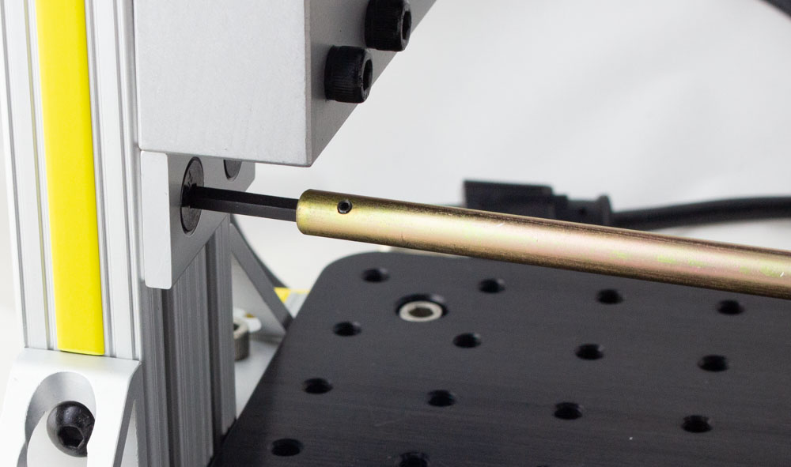
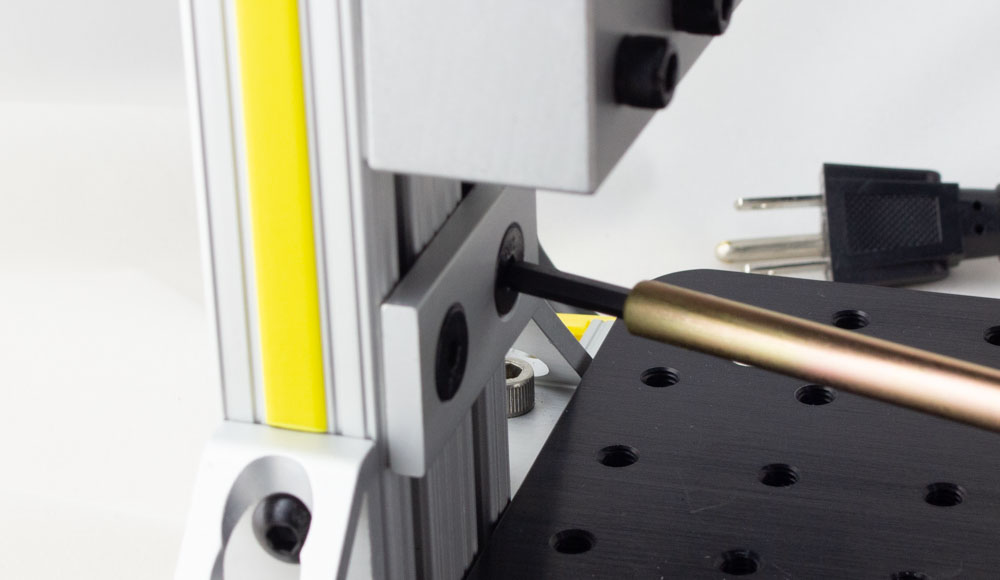
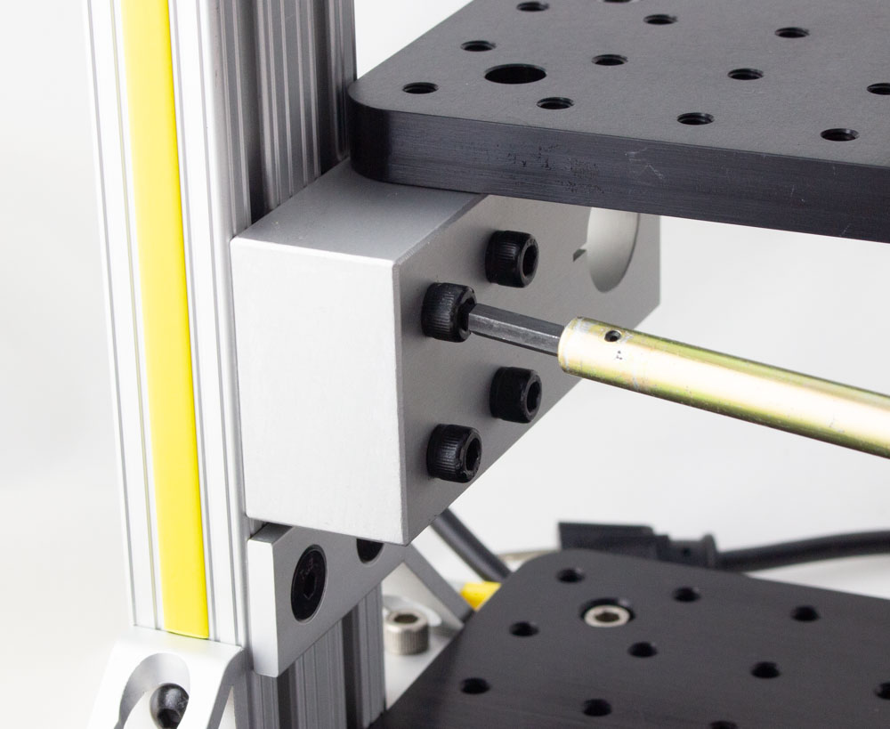
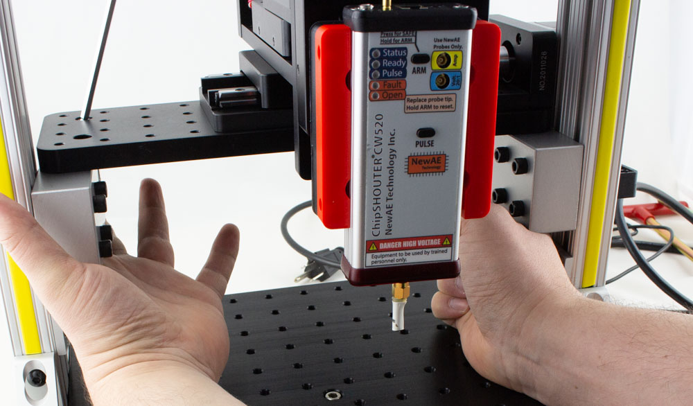

# Medium Res Stage - Rev 0

REV0 is a beta release of the ChipShover platform. This release includes:

* Temporary printed labels instead of final labels
* 3D printed parts

## Stage Assembly & Setup

See the [Rev0Assembly.md](Rev0Assembly.md "Rev 0 Assembly Document") for details of the assembly process.

You should roughly have the following after that page:

## Adjusting Coarse Position

You will have to adjust the position of the ChipShover XYZ stages in a "coarse" fashion to get the ChipShover 50mm travel range to be within the area of your interest. 

To simplify the adjustment, you have been provided with two **extra-long** T-handle socket-end hex wrenches. One is 3/16", and one is 5/32".

The ChipShover table uses a "main adjustment bolt" that locks everything together - this bolt is the upper left bolt on the X-Axis table holder. Whenever you are moving the table either in Y or X you will have to loosen this bolt. Once you have finished the adjustment, tighten this bolt to ensure no other bolts loosen:

**NOTE: For all adjustments you should LOOSEN but not REMOVE any bolts. If you fully remove any bolt, be sure to thread them back before continuing.**

### Y Adjustment

1. Loosen the main adjustment bolt:

	

2. Loosen the **four** bolts on each side using a 3/16" hex wrench:

	

   	**NOTE: One of the bolts will require you to access it at an angle - you may wish to only snug up this bolt to make adjustments easier**
	
	

3. Pull the table to the new position:

	

4. Tighten the **four** bolts on each side using a 3/16" hex wrench:

	

5. Tighten the main adjustment bolt:

	

### Z Adjustment

**WARNING: When adjusting the Z axis, you may wish to remove the ChipSHOUTER mount. It is easy to knock the ChipSHOUTER during this operation which may damage it.**

#### Lowering

1. Using a 5/32" wrench, loosen the Z-stop bolts:

	

2. Set the new Z-stop location and tighten the bolts:

	

3.  Using a 3/16" hex wrench, loosen the four bolts underneath the X axis table on the left and right sides.

	

4. Loosen the main adjustment bolt, holding the table while doing so:

	

5. Gently lower the table onto the Z-axis stops:

	

6. Tighten the X axis table bolts - 4 on each side:

	

7. Tighten the main adjustment bolt:

	

Done!

#### Raising

1. Using a 3/16" hex wrench, loosen the four bolts underneath the X axis table on the left and right sides. Note there is a "stop" piece that will prevent any movement (dropping), you may wish to ensure these bolts are tight.

	

2. Loosen the main adjustment bolt:

	

3. Push up on both blocks to raise the table - you may need to *further* loosen some of the four bolts underneath each side from step 1 for this to work:

	

4. Keeping one hand on a block to "lock" it in place, tighten the main adjustment bolt. Note in the photo above you may find it handy to simply leave the provided shorter 3/16" wrench in the main bolt to make this easier:

	

5. Tighten the X axis table bolts - 4 on each side:

	

6. The Z-Stops are now too low - loosen the Z-stop bolt (using a 5/32" wrench):

	

7. Raise the Z-Stops and tighten them again:

	

Done!

## Mounting Boards to Base Plate

Typically you will need to mount various boards to the base plate for EMFI and SCA attacks.

### Board Mounting Kit

We provide a board mounting kit, which consists of three pieces:

* Adjustable M6/slot to 4-40 base
* M6 mounting bolt
* 4-40 standoffs

This allows you to mount boards to the base, as in this example:

<PHOTO>

To set this up, simply:

1. Select a stand-off height as appropriate for your board. Typically the shortest stand-off possible provides the best mechanical stability.
2. Roughly position the board and base pieces.
3. Loosely insert the M6 bolts & 4-40 bolts.
4. Tighten all bolts, performing final adjustments as needed before final tightening.

Be sure to consider the movement of the XY table and where your actual chip of interest is located. You can normally mount the board to provide some additional "coarse" adjustment range which makes for more rapid setup.

NOTE: We use a 4-40 thread in these plates as 4-40 bolt has a 2.85mm diameter. Thus a 4-40 bolt will always allow you to mount a board expecting a M3 bolt, as the 4-40 bolt has a slightly smaller diameter.

### Other Mounting Hardware

The base plate uses standard M6 threaded holes on a 25 x 25mm pattern. This allows usage of almost any optical mounts to help with your board mounting solutions.

In particular [Thor Labs](https://www.thorlabs.com/navigation.cfm?guide_id=2065) has a variety of mounts which you may find useful.

The metric [Pillar Post System](https://www.thorlabs.com/newgrouppage9.cfm?objectgroup_id=1316) provides a similar (but more rigid) solution to our board mounting kit. Note this uses a M6 bolt on top of the pillar - you likely will want to order a quantity of [M6 external to M3 internal adapters](https://www.thorlabs.com/thorproduct.cfm?partnumber=MSA6/M#ad-image-0). You can use this with M3 standoffs to easily mount boards to your table, or even [M3 to 4-40 adapters](https://www.mcmaster.com/91648A109/) if you need smaller screw holes.