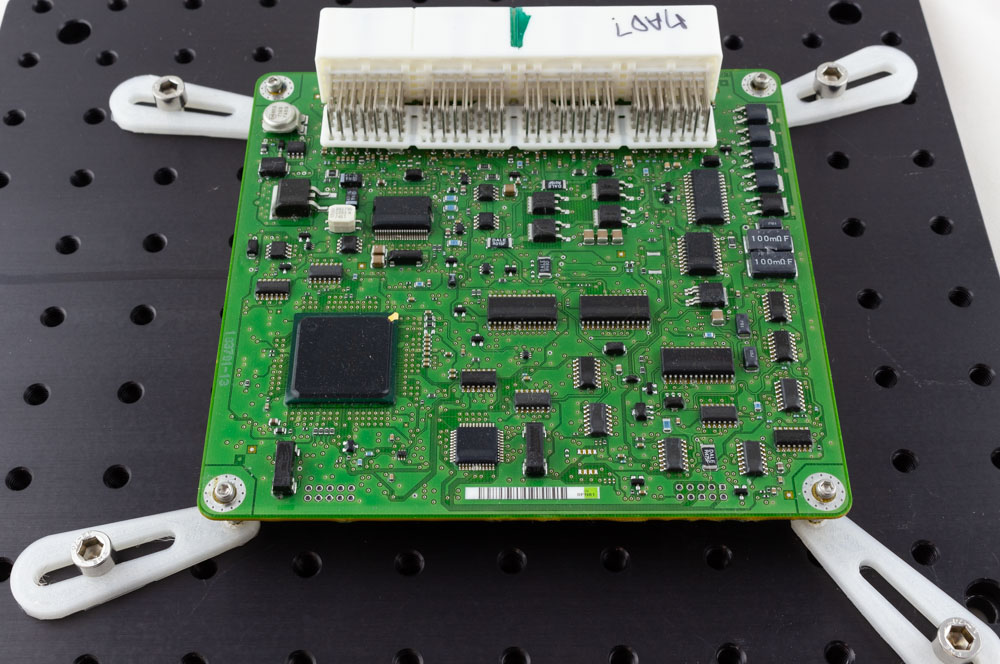

# Medium Res Stage - Rev 1

REV1 is the initial release of the ChipShover platform. Updates will continue to be made to the platform.

## Stage Assembly & Setup

See the [Rev1Assembly.md](Rev1Assembly.md "Rev 1 Assembly Document") for details of the assembly process.

## ChipShover Python Interface

See [chipshover.readthedocs.io](https://chipshover.readthedocs.io/) for the full Python interface details.

## Adjusting Coarse Position

You will have to adjust the position of the ChipShover XYZ stages in a "coarse" fashion to get the ChipShover 50mm travel range to be within the area of your interest. 

### Y Adjustment

Loosen the two bolts along the Y sliders using a 3/16" hex, move to new position, tighten bolts.

### Z Adjustment

Holding the ChipShover upper table, release the four clamps. Adjust to the new position and tighten the clamps.

### Board Mounting Kit (PCB Paws)

We provide a board mounting kit, which consists of three pieces:

* Adjustable M6/slot to 4-40 base
* M6 mounting bolt
* 4-40 standoffs

This allows you to mount boards to the base, as in this example:

To set this up, simply:

1. Select a stand-off height as appropriate for your board. Typically the shortest stand-off possible provides the best mechanical stability.

	

2. Roughly position the board and base pieces.

3. Loosely insert the M6 bolts & 4-40 bolts.

4. Tighten all bolts, performing final adjustments as needed before final tightening.

Be sure to consider the movement of the XY table and where your actual chip of interest is located. You can normally mount the board to provide some additional "coarse" adjustment range which makes for more rapid setup.

NOTE: We use a 4-40 thread in these plates as 4-40 bolt has a 2.85mm diameter. Thus a 4-40 bolt will always allow you to mount a board expecting a M3 bolt, as the 4-40 bolt has a slightly smaller diameter.

### Other Mounting Hardware

The base plate uses standard M6 threaded holes on a 25 x 25mm pattern. This allows usage of almost any optical mounts to help with your board mounting solutions.

In particular [Thor Labs](https://www.thorlabs.com/navigation.cfm?guide_id=2065) has a variety of mounts which you may find useful.

The metric [Pillar Post System](https://www.thorlabs.com/newgrouppage9.cfm?objectgroup_id=1316) provides a similar (but more rigid) solution to our board mounting kit. Note this uses a M6 bolt on top of the pillar - you likely will want to order a quantity of [M6 external to M3 internal adapters](https://www.thorlabs.com/thorproduct.cfm?partnumber=MSA6/M#ad-image-0). You can use this with M3 standoffs to easily mount boards to your table, or even [M3 to 4-40 adapters](https://www.mcmaster.com/91648A109/) if you need smaller screw holes.