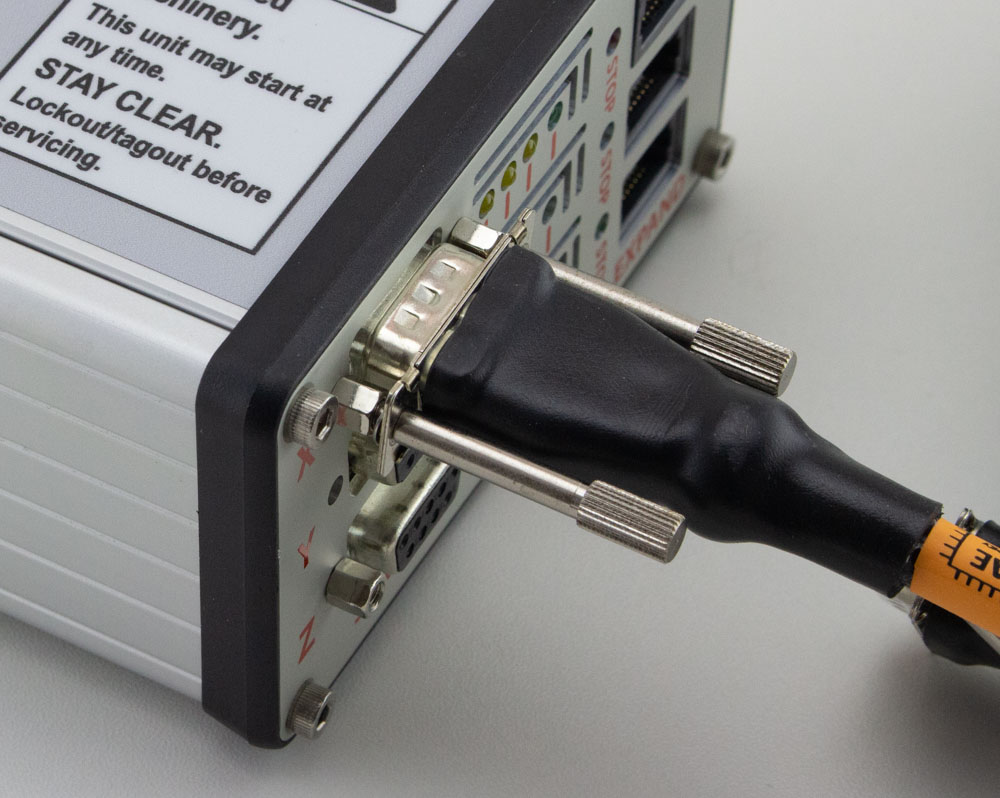

# Medium Res Stage - Rev 2 Assembly

NOTE: These are draft instructions, so images etc will be improved in the released version! We have left these here due to some delays in production & our desire to avoid delaying shipping hardware just to finish the instructions themselves.

## 1. Remove Base & Remove Shipping Screws

The one box contains a few parts & subboxes. Remove these carefully, and then find the base. The base has the X stage preinstalled, but the Y and Z stage are strapped to the base for transit.

Carefully place the base on the table, it should look like the following image. Note the 8 bolts (four per stage) which are highlighted below, these are shipping bolts which will need to be removed:

The left stage is the Y stage, it includes the black Z-stage mounting bracket. The right stage is the Z stage, it includes the ChipShover holder.

You may need to use the manual adjustment knob on the end of the stage stepper motor to adjust the stage forward to access the bolts clearly.

To remove them, use the provided M5 ball-end driver. The bolts are M6x10 bolts, and you will reuse them for mounting the stages. Remove all the bolts now, but you can leave the stages sitting on the protective cardboard sheet.

## 2. Mount Y stage.

You will need to use the thumb wheel to move the Y stage forward until all 8 mounting holes are exposed:

The Y stage includes the Z-stage mounting bracket. Using only 3 M6x10 bolts, mount that stage to the X stage as shown below (note one hole cannot accept a screw). DO NOT use any longer than M6x10 bolts!

## 3. Mount Z Stage

You can now mount the Z stage. You can adjust the position of it, but is suggested as shown here, using these 8 holes towards the bottom of the mount, and leaving the top 4 holes unused:

This will look like the following when mounted:

You may wish to start only with mounting a couple M6x10 bolts, but all M6x10 bolts can be mounted on this stage if you wish.

## 4. Connect Stepper Cables

The stepper motor cables are all standard DB-9 straight-through cables. The provided cables are 22AWG cables allowing a more powerful drive, although we have tested with standard 26AWG IDC cables successfully. Thus if you require extensions or replacements, and off the shelf cable should work.

Due to the spacing at the ChipShover controller the ChipShover mating side cannot use a backshell. Thus you may be limited to IDC style cables for off the shelf cables.

The X/Y/Z/ axis cables are electrically identical, but with different backshells to fit the stage orientation more cleanly. To connect them:

1. Connect each cable to the DB9 connector on each stage. The Z axis connector is straight up and the cable should be routed to a cable mount, the X and Y axis cables are right-angle and will route the cable downward (Y-axis) or upward (X-axis) as appropriate for the best install.
2. Tighten screws on the stage end connector. Use provided screwdriver if required (see tool kit).
3. Connect the other end of each cable to the ChipShover controller - the captive screws need to be tightened to mate the cables.

4. The straps which were used for holding parts of the ChipSHOUTER holder in can be used as cable straps. To do this, pass a M6x10 bolt through the end of them, and bolt on an appropriate part of the table. The exact setup will depend on where you position The ChipShover-One Controller:

	**HINT: If you you need to remove the captive screws from the cable on the ChipShover-One controller end, do this by holding the retaining washer with pliers and "backing out" the bolts.**

## 10. Optional - Test Table

At this point you can test the table before mounting the ChipSHOUTER. To test the table stand-alone:

1. Connect the power supply (4-pin mini-DIN).
2. Turn the power switch on - the switch should illuminate green. If the switch does not illuminate check the power supply.
3. The ChipShover should boot & display status information.
4. Release the E-Stop button by *Rotating it clockwise*, as the E-Stop may have been engaged during shipping.
5. Hold the "stop / home" button for 3-4 seconds - the ChipSHOVER should start the homing operation. You can release the button once it starts the homing operation.
6. **If the homing operation is failing (such as not detecting end-stops) press the E-Stop button immediately**.
7. Press the "Jog En" button to enable the joystick. You will see the Jog En light turn on.
8. Move the joystick in X & Y, and rotate it for Z. The current firmware moves by a fixed amount for each time period (this interface will be adjusted in the future). You can also hit the 'Fast Jog' button which changes the step size.
9. Power off the ChipShover & complete the rest of the steps.

## 11. Add ChipSHOUTER Mounting Bracket

The ChipSHOUTER mounting bracket fits onto the Z axis stage, and is pre-installed for shipping. You can move it to be mounted "lower" on the Z stage, where only the upper 2 bolts are used which provides more clearance if you wish:

Be sure to check you have sufficient clearance for the power & other connectors on the top-side of the ChipSHOUTER. If the ChipSHOUTER is mounted too high, it will cause a collision with the ChipSHOUTER cables and top of the stage.

The beveled end of the mounting bracket faces up.

## 12. Mount ChipSHOUTER

To mount the ChipSHOUTER into the bracket, use the two sliders on the side of the ChipSHOUTER. They should be positioned such the stops in the bracket will prevent the ChipSHOUTER from falling too low:

To fix the position of the ChipSHOUTER, snug the thumbscrews that hold the sliders in position **while holding the ChipSHOUTER and sliders from below**:

Depending on your use-case, you might want to leave the bolts only tight enough to hold the bracket secure, but still loose enough such the ChipSHOUTER can slide if you accidentally drive it into your chip.

The bolt mounting allows you to quickly adjust the spacing of the ChipSHOUTER to compensate for various height boards you mount.

**NOTE:** You also may want the ChipSHOUTER at the "lower limit" of travel, such that it cannot drop any further. This prevents the ChipSHOUTER from dropping suddenly if the bolts loosen due to vibration of the table.
 