# Medium Res Stage - Rev 1 Assembly

NOTE: Due to use of US-centric parts (1" extrusion rails), some parts in this assembly are imperial screws/bolts.

As much as possible, imperial bolts are stainless steel (silver colour), and metric bolts are black.

## 1. Place Stage Frame on Table & Mount Vertical Supports

Remove base table from box, place on table. Yellow end caps may be preinstalled on one side, if so that is the "front". To avoid damage in shipping, we normally don't install the yellow end caps.

Mount vertical rails to base table rails by feeding T-Nuts into extrusion slots. 

Keep the rear of the rail support flush with the rear of the table for now. Lightly tighten the T-nuts using a 3/16 hex wrench (the uprights will still be a bit "wobbly" for now).

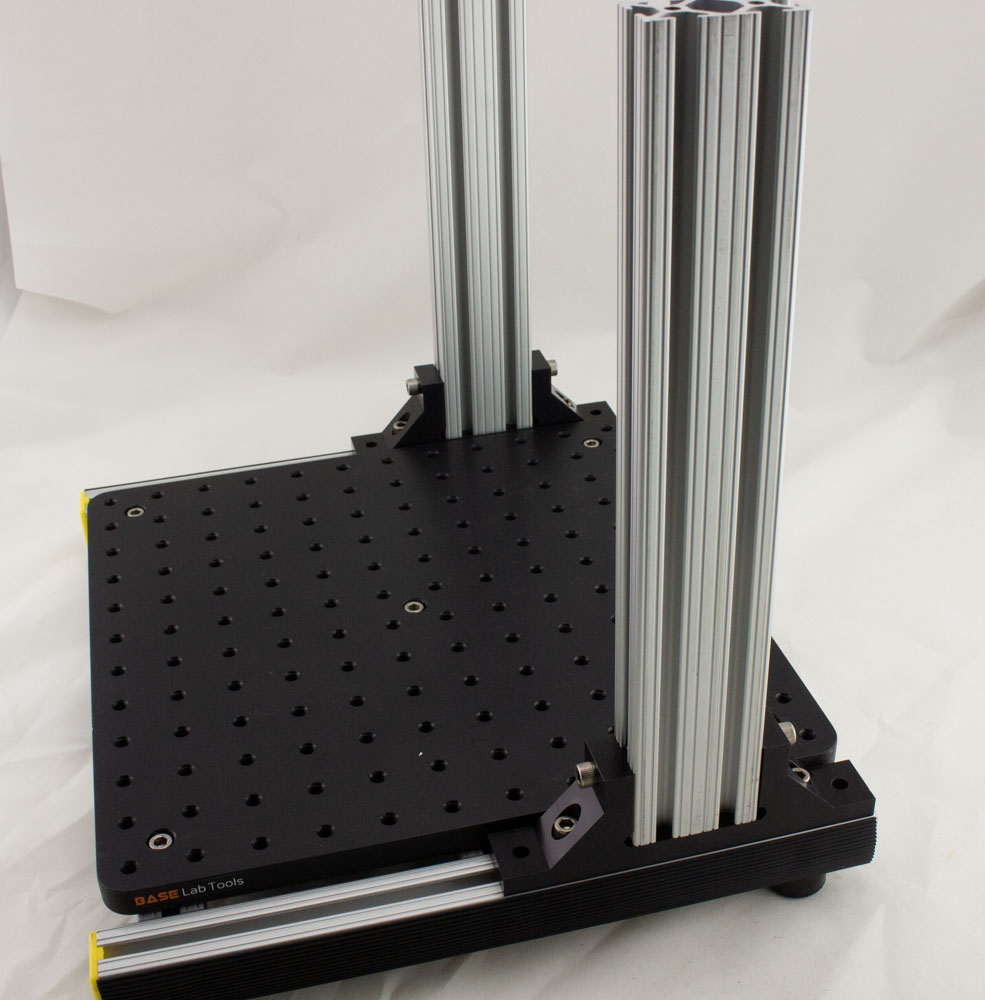

## 2. Mount Vertical Sliders with Upper Table (X Stage Support)

Slide the vertical table down the supports:

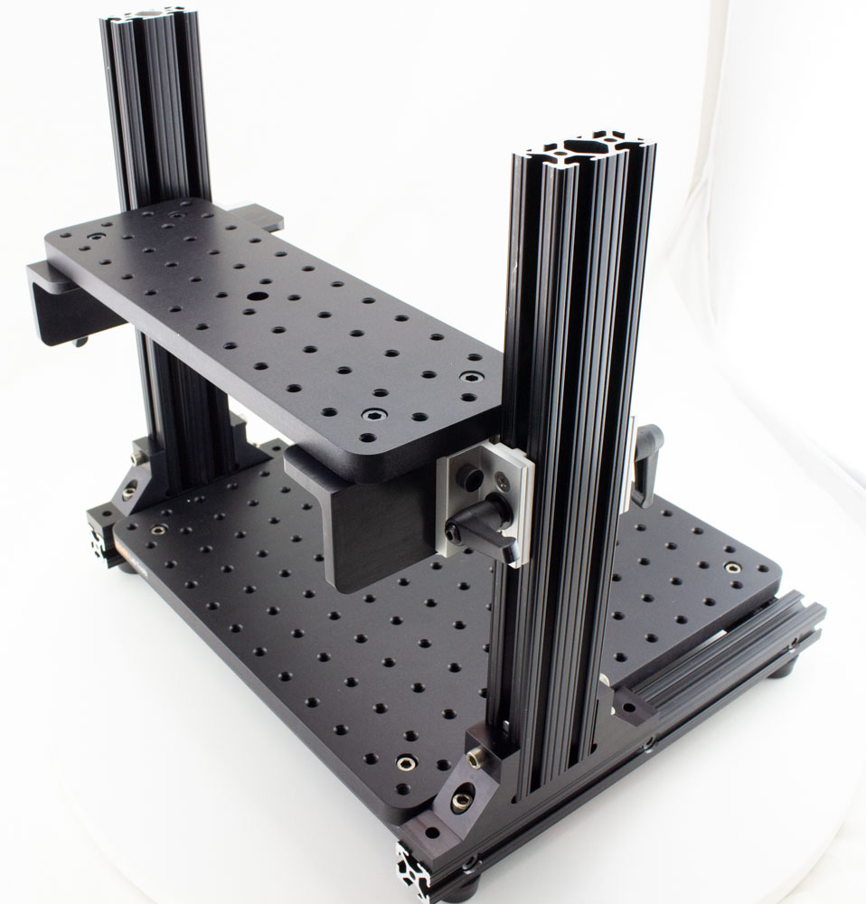

To tighten the brakes on the slider, there are two L-handles on each side. To use them, you can turn them to tighten the brake. When you each the range of opening or closing, pull the handle out which disengages it from the bolt, allowing you to rotate it back:

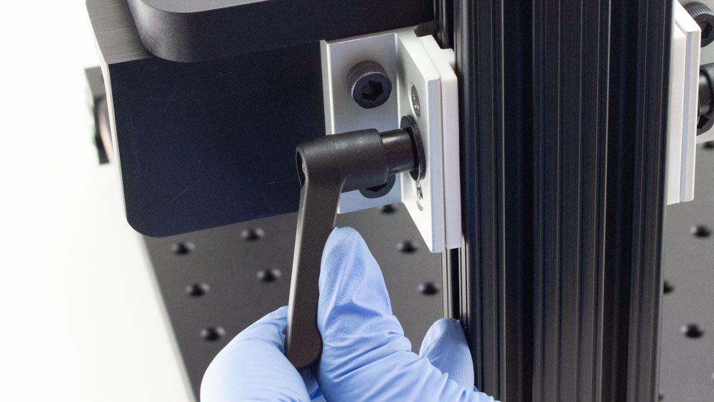

You might prefer to just use a 3mm wrench to tighten and loosen the brake, especially during setup:

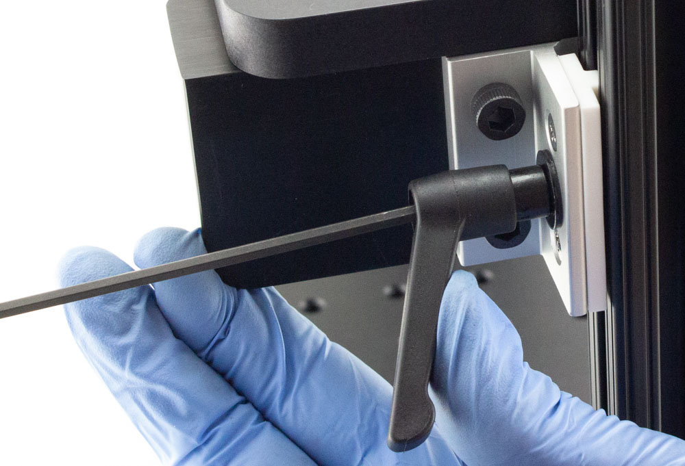

When done, pull the handles out to disengage the brake, and move them out of the way so you don't hit them by accident:

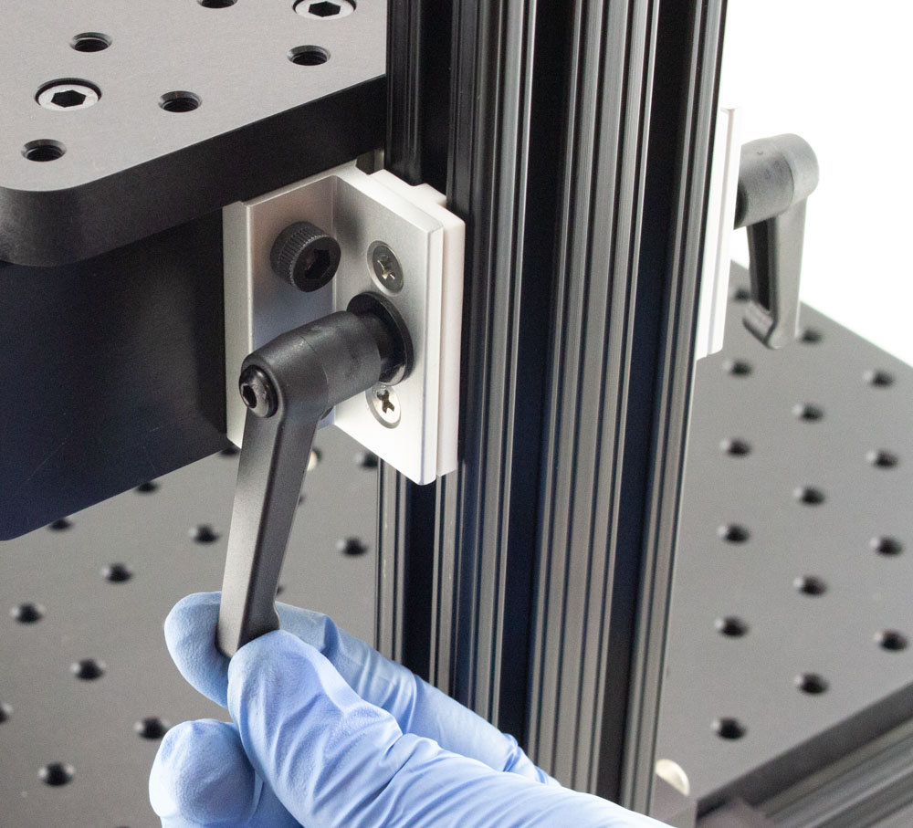

## 3. Install X stage

You will need:

* 8: M6x14 bolts

Position X stage over support table - watch the alignment, as you need room for the DB9 cable to be mounted:

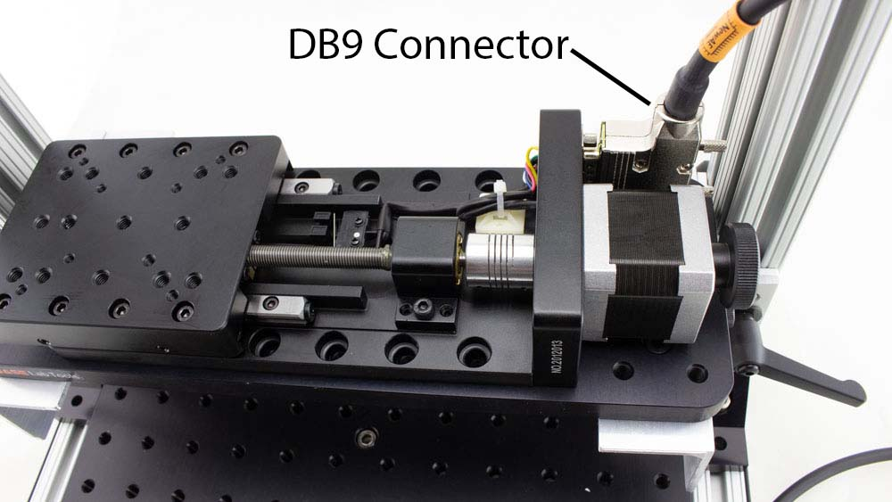

Using the hand wheel, turn the table to expose the mounting holes. Then using 8 bolts, screw the X stage down
(8 bolts is excessive here probably, feel free to reduce this if you think you may adjust the position of the table):

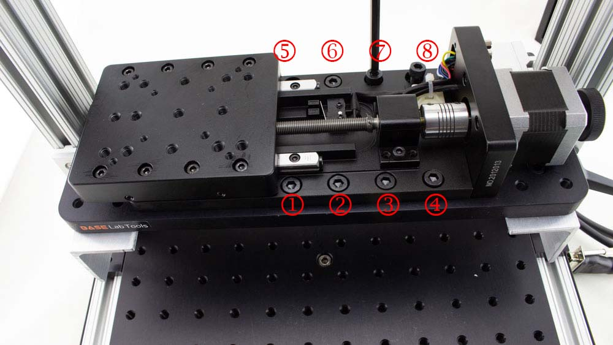

## 4. Mount Y Axis Stage on X Axis

Mount the Y Axis stage perpendicular to the X axis stage. You will see alignment labels on the
X-axis stage that should align with the Y-axis stage. Note it will "overhang" the X axis stage to provide sufficient Y axis travel. The steps to perform the mounting are:

1. Using the handwheel, turn the Y axis stage until all **8** bolt-holes are visible underneath the Y axis stage (4 on each side). You will need to extend it almost to it's full limit for this.
2. Remove the 3x M6 bolts from the package.
3. Place the Y axis stage on the X axis stage - use alignment marks to position it, and keep one hand on the stage to avoid dropping it. Note that only **3** of the holes have matching threads.

	
4. Insert the M6 bolts, and using a 5mm hex driver tighten each bolt.

	
5. Using the Y axis handwheel, return the stage back to the "home" position (you'll hear the microswitch click). 

## 5. Mount Z Plate on Y Axis

**NOTE: This plate may be installed with the Z-Stage already, if so please follow this step, just hold the Z-Stage as well, and skip the next step as it's already done.**

1. Remove the 4x M6 bolts from the bag labelled "Z Plate to Y Axis Mounting Bolts".
2. Remove the Z plate from the packaging, and place on the Y axis stage.
3. Align the "Mount Z Plate" arrows, and insert the four bolts.

	
4. Tighten the bolts - you'll have an ability to later fine-tune this mounting. You will want to make sure there is some clearance at the front of the Z axis mount when the Y axis is at the home position.

	

## 6. Mount Z Axis on Z Plate

You will be mounting the Z axis "lower" on the Z plate to provide a reasonable working distance for the ChipSHOUTER. The following photo shows where we will be mating the provided 2x M6 bolts - note we are *not* using the upper slot.

1. Remove the 2x M6 bolts labelled "Z Axis to Z Plate Mounting Bolts"
2. Align the edge of the Z axis with the alignment marks on the Z plate.
3. Insert the 2x bolts that will mate into the threaded holes on the Z plate:

	
4. Optionally use the M6x20 bolts with the M6 locknuts.

HINT: You can adjust the position of the Z axis mounting for your own use, we simply provide a suggested mount location.

## 7. Adjustments & Locking Down

Check you have clearance at all limits - watch for example the far end of the X travel, where the Z plate may be close to the supports. You want at least 2-3mm of clearance here:

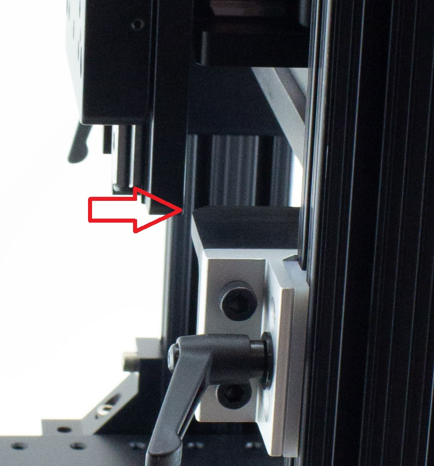

You can adjust this by adjusting the Z-Plate mounting on the Y axis.

You can also adjust the small upper X-support table mount location, but this requires removing the X table (there upright-to-table-support angle pieces use slots allowing some adjustment). To do this, use a 10mm wrench on the flange nuts underneath the upright-to-table-supports.

If everything looks good, lock down the silver bolts you only loosely tightened in Step 1. They will bite into the rails for good rigidity, so this will feel tight. Use a 3/16" T-handle wrench (included).

You can also install yellow caps at this point to block the sharp edges of the extrusion:

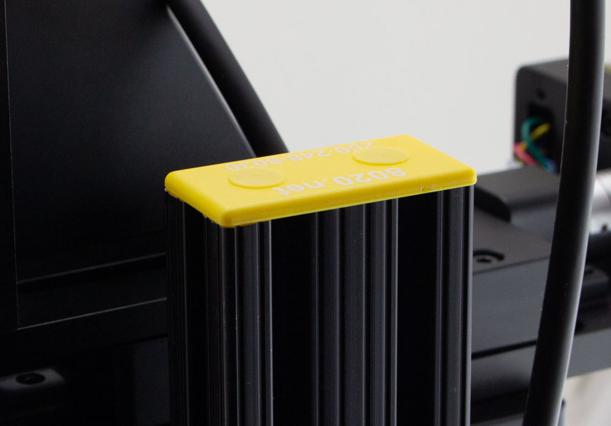

## 8. Add Cable Mounts

You will use the Cable Mounts for routing stepper motor & ChipSHOUTER cables. The suggested uses is as shown here:

To insert them, simply insert into the slot and rotate the cable mounts (old revision shown for ChipShover):

To achieve the suggested mount locations, see this figure  (old revision shown for ChipShover):

## 9. Connect Stepper Cables

The stepper motor cables are all standard DB-9 straight-through cables. The provided cables are 22AWG cables allowing a more powerful drive, although we have tested with standard 26AWG IDC cables successfully. Thus if you require extensions or replacements, and off the shelf cable should work.

Due to the spacing at the ChipShover controller the ChipShover mating side cannot use a backshell. Thus you may be limited to IDC style cables for off the shelf cables.

The X/Y/Z/ axis cables have been labelled to make setup quicker (the cables being electrically identical, but with different backshells to fit the stage orientation more cleanly). To connect them:

1. Connect each cable to the DB9 connector on each stage. The Z axis connector is straight up and the cable should be routed to a cable mount, the X and Y axis cables are right-angle and will route the cable downward (Y-axis) or upward (X-axis) as appropriate for the best install.
2. Tighten screws on the stage end connector.
3. Connect the other end of each cable to the ChipShover controller - the captive screws need to be tightened to mate the cables.

	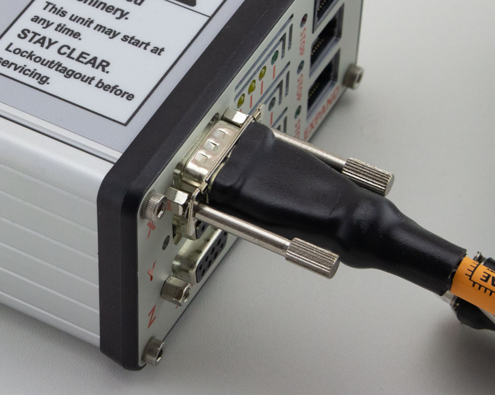

4. Route the cables through the ChipShover cable mounts as suitable (shown here also with ChipSHOUTER mounted - but note the Z stage cable routing through the lower mount).

	

	**HINT: If you you need to remove the captive screws from the cable on the ChipShover-One controller end, do this by holding the retaining washer with pliers and "backing out" the bolts.**

## 10. Optional - Test Table

At this point you can test the table before mounting the ChipSHOUTER. To test the table stand-alone:

1. Connect the power supply (4-pin mini-DIN).
2. Turn the power switch on - the switch should illuminate green. If the switch does not illuminate check the power supply.
3. The ChipShover should boot & display status information.
4. Release the E-Stop button by *Rotating it clockwise*, as the E-Stop may have been engaged during shipping.
5. Hold the "stop / home" button for 3-4 seconds - the ChipSHOVER should start the homing operation. You can release the button once it starts the homing operation.
6. **If the homing operation is failing (such as not detecting end-stops) press the E-Stop button immediately**.
7. Press the "Jog En" button to enable the joystick. You will see the Jog En light turn on.
8. Move the joystick in X & Y, and rotate it for Z. The current firmware moves by a fixed amount for each time period (this interface will be adjusted in the future). You can also hit the 'Fast Jog' button which changes the step size.
9. Power off the ChipShover & complete the rest of the steps.

## 11. Add ChipSHOUTER Mounting Bracket

The ChipSHOUTER mounting bracket fits onto the Z axis stage. Typically it is mounted "low" on the Z stage, where only the upper 2 bolts are used which provides more clearance:

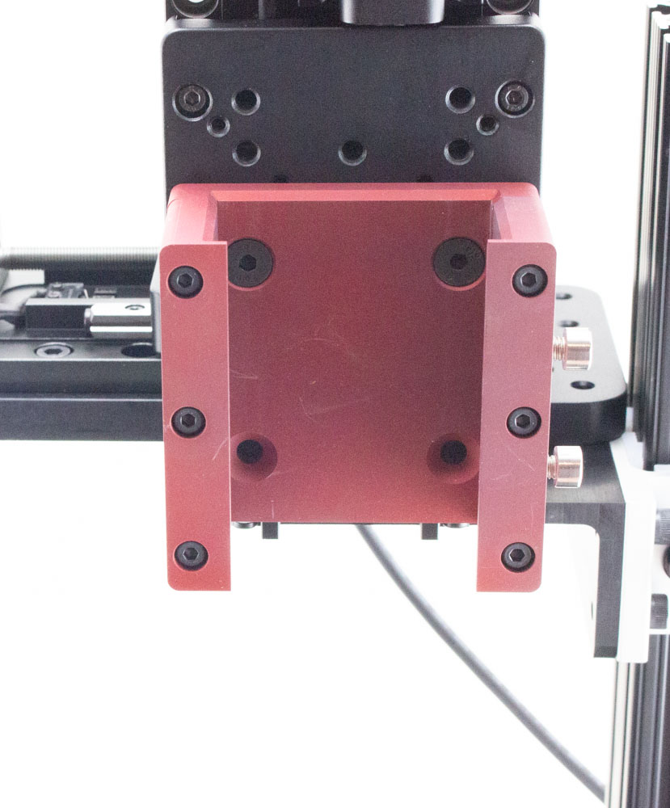

Be sure to check you have sufficient clearance for the power & other connectors on the top-side of the ChipSHOUTER. If the ChipSHOUTER is mounted too high, it will cause a collision with the ChipSHOUTER cables and top of the stage.

The beveled end of the mounting bracket faces up.

## 12. Mount ChipSHOUTER

To mount the ChipSHOUTER into the bracket, use the two sliders on the side of the ChipSHOUTER. They should be positioned such the stops in the bracket will prevent the ChipSHOUTER from falling too low:

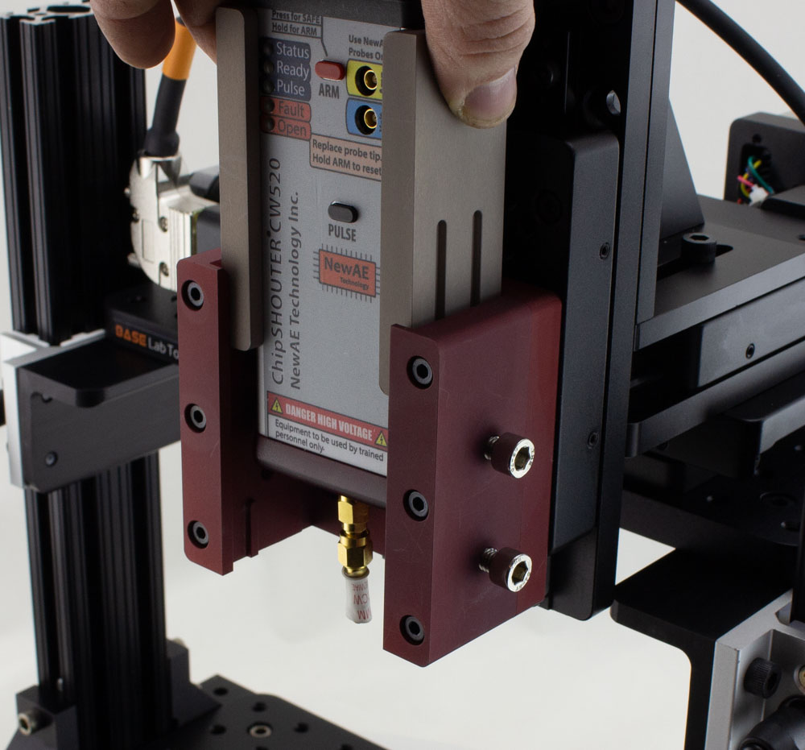

To fix the position of the ChipSHOUTER, snug the bolts that hold the sliders in position **while holding the ChipSHOUTER and sliders from below**:

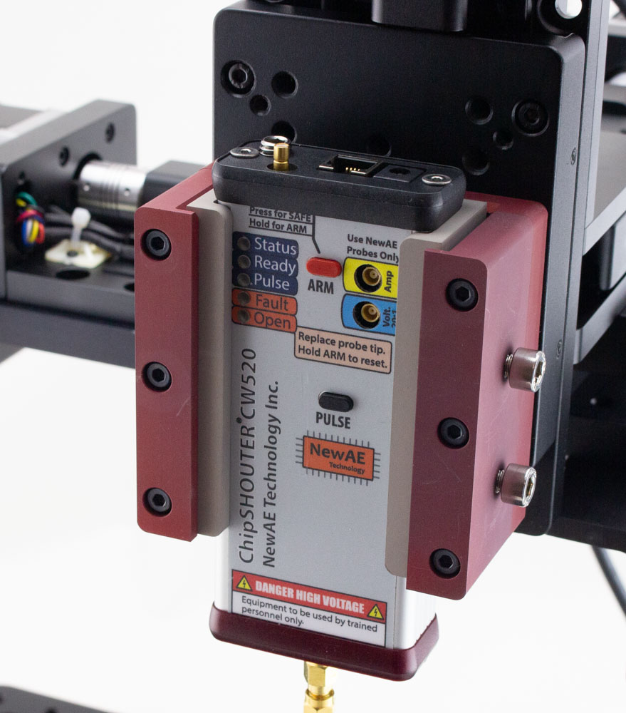

Depending on your use-case, you might want to leave the bolts only tight enough to hold the bracket secure, but still loose enough such the ChipSHOUTER can slide if you accidentally drive it into your chip.

The bolt mounting allows you to quickly adjust the spacing of the ChipSHOUTER to compensate for various height boards you mount.

**NOTE:** You also may want the ChipSHOUTER at the "lower limit" of travel, such that it cannot drop any further. This prevents the ChipSHOUTER from dropping suddenly if the bolts loosen due to vibration of the table.
 